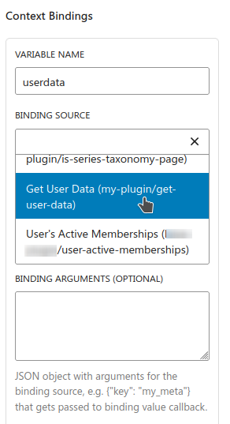

# Installation
Clone repo in `wp-content/plugins/` and install dependencies with `composer install`. Activate plugin and add

# Block bindings

Block bindings provide data accessible for the twig-templating-block which can be mapped to Twig template context variables.

Example block binding registration used in further examples which could be placed in site code (a plugin or theme `functions.php`):
```php
add_action('init', function(){
    register_block_bindings_source(
        'my-plugin/get-user-data',
        [
            'label' => __('Get User Data', 'my-plugin'),
            'get_value_callback' => 'get_user_data_binding_callback',
        ]
    );
});

function get_user_data_binding_callback($source_args, $block_instance) {

    if (!is_user_logged_in()) {
        return;
    }

    $user_posts = get_posts([
        'author' => get_current_user_id(),
        'numberposts' => -1, // Get all posts
        'post_type' => 'post',
        'post_status' => 'publish',
        'fields' => 'ids' // Return only post IDs
    ]);
    return ["posts" => $user_posts];
}
```

When new bindings are registered, the Site Editor needs to be reloaded. Afterwards it becomes available in Twig Templating Block attribute panel as follows.



# Twig templating

After mapping data to Twi

## Full Site Editor / Block Theme compatibility
Generally, the Twig Templating Block works can be used inside both Template Parts and Block Patterns, and render them in place for maximum compatibility with Full Site Editor and Block Theme facilities.

### Template Parts
Twig function `include_template_part($slug, $postID = null)` renders a WordPress Template Part with given `slug` and optional `PostID` if it cannot be inferred from the global state.

Setting `PostID` is useful as example when looping inside Twig templates:

```twig

  {{ include_template_part('post-card', post_id) }}

```

### Block patterns
Similar to Template Parts, Twig function `include_pattern($slug, $postID = null)` renders a WordPress Block Pattern with given `slug` and optional `PostID`.

Block patterns are for publishing & sharing "partials" between various sites and when saved into block theme (with [Create Block Theme](https://wordpress.org/plugins/create-block-theme/) plugin) they get "baked" into the theme template markup and stop existing as Block Patterns in the database. Thus it's better to use the Template Parts for general site specific templating.

### Calling block bindings

While generally block bindings are mapped as template variables for the Twig template, they can also be called as a Twig function `call_block_binding($source, $args = [], $global_context_overrides = [])`.

Normally block binding callback function accesses global state defined via `uses_context` in `register_block_type` and it works as expected within Block Theme templates, the Query Loop block, and when calling template parts / patterns for rendering. When looping in Twig, to have block binding calls depending on global state work as expected, the global state change may need to be overridden during block binding call with `$global_context_overrides` is associative array. While it's expected to support `uses_context` values as keys, currently only postID support is implemented.


```twig

  <!-- This would fetch status of the global post object with the default block binding context -->

  
  <p>Post status is: {{status}}</p>


```

## Editor previews

WIP section

By default, the block preview renders only list of context variable names that have been set.

There's a concept different preview modes, including server-side rendered preview with overridden global PostID. Some experimentation also has been done with TwigJS which might be discarded.

# Known issues

## Composer compatibility issues with WordPress
Composer autoloader without classname scoping does not play well if same dependencies are used from many places, example discussion https://github.com/timber/timber/discussions/2815. Works fine as the only Timber/Twig related dependency on a site but might require some work otherwise. Known to work with Timber/Twig used in custom blocks e.g. https://github.com/jasalt/wp-block-experiments.
